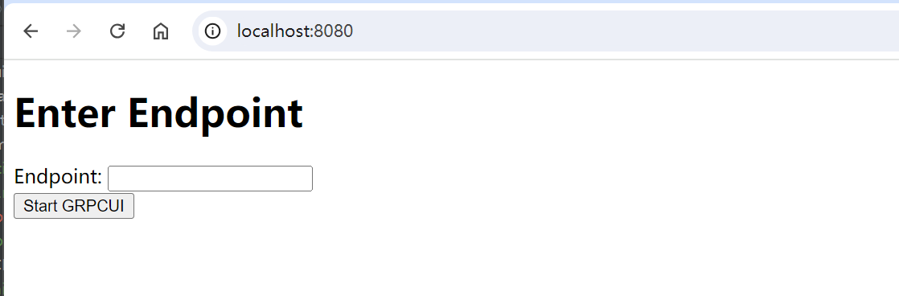
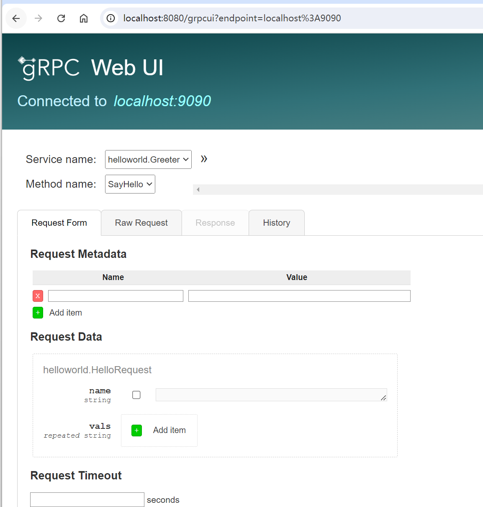

# grpcui-proxy

A grpc debugging tool based on [grpcui](https://github.com/fullstorydev/grpcui), providing server deployment capabilities.

## Usage

### build

```shell
 go build -o grpcui-proxy
```

### run

```shell
./grpcui-proxy -port 8080
```

### use

open browser and visit `http://localhost:8080/` to use grpcui-proxy



enter the grpc server endpoint and click `Start GRPCUI`, then you can use grpcui to debug grpc server.



## end
this project is based on [grpcui](https://github.com/fullstorydev/grpcui), and add server deployment capabilities. If you have any questions, please feel free to contact me. 

my email:  <a href="1571566616@qq.com">1571566616@qq.com</a>
